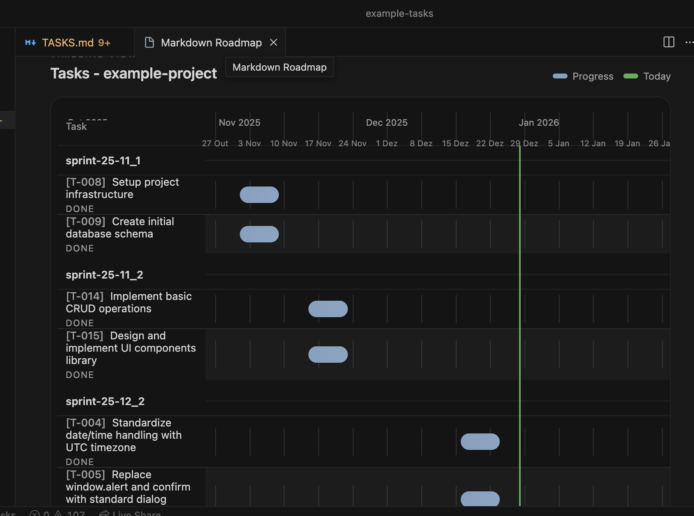
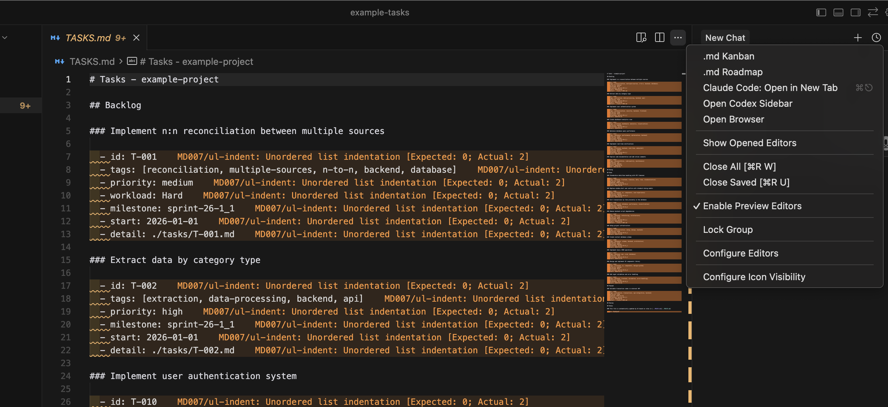

# Markdown Kanban
> Made by cursor

A powerful VS Code extension that transforms Markdown files into interactive Kanban boards, supporting task management, drag-and-drop operations, and rich task attributes.

## 🎯 Philosophy

This extension is designed with **AI-first development** and **large-scale projects** in mind. It provides a structured, machine-readable format that enables AI assistants to effectively manage complex task hierarchies, detailed documentation, and project planning.

**Key Design Principles:**
- **AI-First Thinking**: Task format and structure optimized for AI assistants to read, create, and maintain
- **Scalability**: Built to handle large projects with hundreds of tasks and extensive documentation
- **Separation of Concerns**: Main board (`TASKS.md`) stays clean and focused, while detailed information lives in separate files (`tasks/T-XXX.md`)
- **Machine-Readable**: Structured format that AI assistants can parse, validate, and manipulate programmatically
- **Human-Friendly**: Remains readable and editable by humans while being optimized for AI workflows

**Ideal For:**
- Large-scale software projects with complex task hierarchies
- AI-assisted development workflows (Cursor, GitHub Copilot, etc.)
- Teams using AI assistants for task management and project planning
- Projects requiring detailed documentation and step tracking
- Sprint planning and milestone management

## For Cursor Users

If you're using **Cursor IDE**, add the rules to your **User Rules** to enable AI assistants to properly create and manage tasks in the Markdown Kanban format:

1. Open Cursor Settings → **User Rules**
2. Copy the content from [`rules/.cursorrules`](./rules/.cursorrules)
3. Paste it into your User Rules

This will ensure AI assistants understand the task format and maintain compatibility with the extension.

**Rules Documentation:**
- [`.cursorrules`](./rules/.cursorrules) - Rules for Cursor IDE (copy to User Rules)
- [`AGENTS.md`](./rules/AGENTS.md) - General rules for any AI assistant
- [`CLAUDE.md`](./rules/CLAUDE.md) - Specific rules for Claude AI

## ✨ Features

### Kanban Board View


### Roadmap View


The Roadmap view provides a timeline visualization of your project, perfect for:
- **Large Project Planning**: Visualize hundreds of tasks across time
- **Sprint Management**: Track milestones and sprint progress
- **AI-Assisted Planning**: AI assistants can help plan and adjust timelines
- **Progress Tracking**: See project progress at a glance with visual progress bars

### 📋 Basic Features
- **Markdown Parsing**: Automatically parses task lists from Markdown files.
- **Kanban View**: Displays tasks in a Kanban board format with multi-column layout.
- **Drag & Drop**: Supports dragging and dropping tasks between different columns.
- **Real-time Sync**: Ensures real-time, two-way synchronization between the Kanban board and the Markdown file.

### 🎯 Task Management
- **Task Collapse/Expand**: Tasks are collapsed by default, showing only the task name, priority, and tags. Click to expand for details.
- **Priority Support**: Supports three priority levels: High (🔴), Medium (🟡), and Low (🟢).
- **Workload Support**: Supports four workload levels: Easy (🟢), Normal (🟡), Hard (🔴), and Extreme (🔴🔴).
- **Steps Support**: Supports steps for task management, using `- [ ] step` format.
- **Tagging System**: Supports multiple tags for categorization, using `#tagname` or `[tag1, tag2]` format.
- **Time Management**:
  - Due Date: `due:YYYY-MM-DD`
- **Task Description**: Supports multi-line detailed descriptions, including the new code block format.

### 🆕 Task Format
Supports a structured task format for better readability and organization:
- **Structured Attributes**: Task attributes use an indented list format.
- **Code Block Descriptions**: Use ```` ```md ```` code blocks for detailed descriptions.
- **Array Tags**: Tags support `[tag1, tag2, tag3]` array format.
- **Milestone Format**: Suggested format `sprint-year-month_number` (e.g., `sprint-26-1_1` for January 2026, sprint 1).
- **Backward Compatibility**: Fully compatible with the old inline format.
- **External Detail Files**: For larger projects, tasks can reference external detail files (`detail: ./tasks/T-XXX.md`) to keep the main board clean while maintaining comprehensive documentation.

### 📁 Task Detail Files (Large Projects & AI Development)

For **larger projects** and **AI-assisted workflows**, tasks can reference external detail files to separate high-level overview from detailed documentation:

**Benefits:**
- **Clean Main Board**: Keep `TASKS.md` focused on task overview and status
- **Rich Documentation**: Store detailed requirements, steps, and context in separate files
- **AI-Friendly**: AI assistants can manage detailed task information without cluttering the main board
- **Better Organization**: Complex tasks with many steps are easier to manage
- **Scalability**: Handle projects with hundreds of tasks without overwhelming the main file

**Usage:**
```markdown
### Implement Authentication System
  - id: T-001
  - tags: [backend, security]
  - priority: high
  - detail: ./tasks/T-001.md
```

The detail file (`tasks/T-001.md`) contains:
- Detailed task description
- Step-by-step breakdown
- Requirements and acceptance criteria
- Technical specifications

This separation is especially valuable when working with AI assistants, as they can:
- Maintain detailed task documentation without bloating the main board
- Update steps and progress in dedicated files
- Provide comprehensive context for complex tasks
- Scale to large projects with extensive documentation needs

### Rules for AI Assistants

This project includes comprehensive rules and guidelines to help AI assistants properly create and manage tasks in the Markdown Kanban format. These rules ensure compatibility with the extension and maintain consistency across projects.

**Rules Documentation:**
- [`.cursorrules`](./rules/.cursorrules) - Rules for Cursor IDE (copy to User Rules)
- [`AGENTS.md`](./rules/AGENTS.md) - General rules for any AI assistant
- [`CLAUDE.md`](./rules/CLAUDE.md) - Specific rules for Claude AI

These rules cover:
- Complete task format specification
- Required and optional task properties
- Detail file format (`tasks/T-XXX.md`)
- Status flow and transitions
- Best practices and common mistakes to avoid
- Complete examples and reference guides

> **For AI Assistants**: When working with `TASKS.md` files, refer to the rules in `rules/` directory to ensure you create and manage tasks correctly. These rules are designed to help AI assistants understand the proper format and maintain compatibility with the VS Code Markdown Kanban extension.

See the [example-tasks](./example-tasks/) directory for complete working examples of properly formatted tasks.

### 🔍 Filtering & Sorting
- **Tag Filtering**: Filter tasks by tags; multiple tags (comma-separated) are supported.
- **Multiple Sorting Options**: Sort by Task Name, Due Date, Priority, etc.
- **Clear Filters**: One-click to clear all filtering and sorting conditions.

### 🖥️ UI Features
- **Dual View Mode**:
  - Sidebar View: Compact Kanban display.
  - Main Panel: Full Kanban editing interface.
- **Modern UI**: Adheres to VS Code design guidelines and supports theme switching.
- **Responsive Design**: Adapts to different screen sizes.

## 🔮 Future Features

### GitHub Projects Integration

We're planning to add **bidirectional synchronization with GitHub Projects** to enable seamless integration between local task management and GitHub's project management tools.

**Planned Features:**
- **Sync Tasks to GitHub Projects**: Automatically create and update GitHub Project items from your `TASKS.md` file
- **Bidirectional Sync**: Changes in GitHub Projects reflect in your local Markdown files
- **Issue Linking**: Link tasks to GitHub Issues for better traceability
- **Status Synchronization**: Keep task status in sync between local files and GitHub Projects
- **Milestone Mapping**: Map local milestones to GitHub Milestones
- **AI-Assisted Sync**: AI assistants can help manage the sync process and resolve conflicts

**Benefits for Large Projects:**
- **Team Collaboration**: Share project status with team members through GitHub Projects
- **CI/CD Integration**: Connect task status with automated workflows
- **Visibility**: Stakeholders can view project progress in GitHub without needing the extension
- **Unified Workflow**: Manage tasks locally while maintaining GitHub integration

This feature will be especially valuable for:
- Teams using GitHub for project management
- Open source projects with public roadmaps
- Projects requiring integration with GitHub Actions and workflows
- Organizations that need both local AI-assisted task management and GitHub visibility

> **Note**: This is a planned feature. Stay tuned for updates!

## 🧪 Testing Locally

To test the extension locally during development:

1. **Install dependencies:**
   ```bash
   npm install
   ```

2. **Run in debug mode:**
   - Press `F5` or go to `Run > Start Debugging`
   - Or use the Command Palette (`Ctrl+Shift+P` / `Cmd+Shift+P`) → "Debug: Start Debugging"

3. **Open the example-tasks folder:**
   - A new VS Code window will open (Extension Development Host)
   - Navigate to the `example-tasks` folder and open it
   - Or select "Open Folder" and choose the `example-tasks` folder from the project

4. **Explore the features:**
   - Open the `example-tasks/TASKS.md` file
   - Right-click → "Kanban" or use the Command Palette → "Open Kanban Board"
   - The window will show all extension features with real examples

> 💡 **Tip**: The `example-tasks` folder contains complete examples of tasks with all supported metadata. See the [example-tasks README](./example-tasks/README.md) to understand the complete task format.

## 🛠️ Development

### Prerequisites

1. **Node.js** (v18 or higher)
2. **VS Code Extension Manager (vsce)**
   ```bash
   npm install -g @vscode/vsce
   ```

### Building the Extension

1. **Install dependencies:**
   ```bash
   npm install
   ```

2. **Compile the extension:**
   ```bash
   npm run compile
   ```

3. **Create VSIX package:**
   ```bash
   npm run package
   ```
   This will:
   - Run type checking
   - Run linting
   - Build the extension for production
   - Create a `.vsix` file in the project root

4. **Install locally for testing:**
   ```bash
   code --install-extension markdown-kanban-roadmap-*.vsix
   ```

### Available Scripts

- `npm run compile` - Compile TypeScript and build the extension
- `npm run watch` - Watch mode for development (auto-rebuild on changes)
- `npm run package` - Create production build and VSIX package
- `npm run lint` - Run ESLint
- `npm run check-types` - Type check without emitting files
- `npm test` - Run tests
- `npm run test:parser` - Test markdown parser

### Publishing

For publishing instructions, see [PUBLISH.md](./PUBLISH.md).

## 🚀 Quick Start

### Installation
1. Search for "Markdown Kanban" in the VS Code Extension Marketplace.
2. Click Install.

### How to Use

#### 1. Create a Markdown Kanban File

```markdown
# My Project Board

## To Do

### Design User Interface

  - due: 2024-01-15
  - tags: [design, ui, frontend, backend]
  - priority: high
  - workload: Hard
  - defaultExpanded: true
  - steps:
      - [x] asd
      - [x] xgfs
    ```md
    Design user login and registration pages, including:
    - Responsive layout design
    - Brand color application
    - User experience optimization
    ```

### Write API Documentation

  - due: 2024-01-20
  - tags: [documentation, backend]
  - priority: medium
    ```md
    Write complete REST API documentation using OpenAPI 3.0 specification.
    Include request and response examples for all endpoints.
    ```

## Done

### Project Initialization

  - due: 2024-01-05
  - tags: [setup]
  - priority: low
```

#### 2. Open Kanban View



You have three ways to open the Kanban board:

- **Method 1**: Right-click on the Markdown file → Select "Kanban"
- **Method 2**: Use the Command Palette (`Ctrl+Shift+P` or `Cmd+Shift+P`) → Type "Open Kanban Board"
- **Method 3**: Click the "Kanban" button in the editor toolbar

#### 3. Use Filtering and Sorting
- **Tag Filtering**: Enter tag names in the top filter box (e.g., design,ui).
- **Sorting**: Use the sort dropdown menu to select a sorting method.
- **Clear**: Click the "Clear Filters" button to reset all conditions.

#### 4. Task Operations
- **View Task**: Click on a task card to expand/collapse detailed information.
- **Move Task**: Drag and drop tasks to different columns.
- **Edit Task**: Click the "Edit" button on a task.
- **Delete Task**: Click the "Delete" button on a task.
- **Add Task**: Click the "+ Add Task" button at the bottom of a column.

#### 5. Column Management
- **Hide Column**: Click the eye icon on the right side of the column title.
- **Show Hidden Columns**: Click the "Manage Columns" button and enter the column number when prompted.
- **Reorder Columns**: Drag and drop column titles to reorder them.

#### 6. Enable or Disable File Switching
- **Change the setting**: Use the Command Palette (`Ctrl+Shift+P` or `Cmd+Shift+P`) → Type "Enable/Disable File Switcher"

